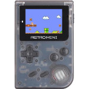

# RetroMini (RS90)

  
|Component|Description                         |
|---------|------------------------------------|
|CPU      |Ingenic JZ4725B 360MHz              |
|RAM      |32MB                                |
|Storage  |256MB                               |
|Screen   |2.0" 240x160                        |
|Slot     |MicroSD                             |
|Gamepad  |DPad、2 Buttons、L、R、Select、Start|
|USB      |Client                              |
|Battery  |3.7V 1020mA                         |
|Dimension|105mm x 70mm x 22mm                 |
|Weight   |103g                                |

### https://steward-fu.github.io/website/index.htm
